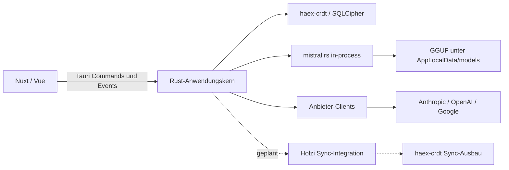

# Holzi: erster MVP mit lokalem Chat und Anbietermodellen

Stand: 2026-09-09 (überarbeitet). Ursprungsfassung 2026-09-07. Geplant gegen Holzi-Commit `bf4752b` und `haex-crdt` Commit `1c069ef` (Cargo-Version 0.4.0, kein Tag; siehe Contract-Pin).
Status: **Entwurf zur Produkt- und Architekturabstimmung**, keine freigegebene Implementierungsspezifikation.
Priorität P1 · Aufwand L · Integrationsrisiko mittel · Kategorie direction.

## Was sich gegenüber der Fassung vom 2026-09-07 geändert hat

Die Erstfassung entstand, bevor der Betreiber den MVP-Schnitt präzisiert hat. Sieben Festlegungen wurden am 2026-09-08 geändert; sie sind hier zusammengefasst, damit der Unterschied nachvollziehbar bleibt und nicht stillschweigend in spätere Reviews driftet.

| Thema | Fassung 2026-09-07 | Festlegung 2026-09-08 | Begründung |
| --- | --- | --- | --- |
| Sync im MVP | „erst mit funktionierendem Zwei-Geräte-Sync fertig" | Sync ist **nicht** Teil des MVP | Betreiber will zuerst eine benutzbare Einzelgerät-App |
| LLM-Runtime | `llama.cpp` als Tauri-Sidecar | `mistral.rs` in-process | iOS erlaubt keine fremden Subprozesse; ein Sidecar bedeutet zwei Runtimes |
| Anbietermodelle | „Noch nicht im MVP: Cloudanbieter" | Anthropic, OpenAI, Google **ab Tag 1** | Betreiber will vorhandene Abos und Keys sofort nutzen |
| Modellbezug | Offline-Modellpaket plus Import | On-Demand-Download aus dem Anbieterkatalog plus Import eigener GGUF | Ein gebündeltes Modell bläht das Paket; Download deckt mehr Hardwareklassen ab |
| Dateikopie als Kopplung | „eine Dateikopie ersetzt Pairing nicht" | Dateikopie **und** Token-Kopplung sind beide zulässige Wege | Betreiber hält den Kopierweg für den bequemeren Regelfall |
| Mobile | „beantwortet Mobile-Inferenz noch nicht" | Mobile wird im Datei- und Pfadmodell mitgedacht | Alle Modelldateien liegen unter `AppLocalData`, damit Android/iOS zugreifen können |
| Modellliste | implizit gepflegt | Anbietermodelle werden **immer abgefragt**, nie hartkodiert | Neue Anbietermodelle sollen ohne Holzi-Update erscheinen |

Unverändert gültig aus der Erstfassung: Schlüsselhaltung samt Konstitutionskorrektur, die Datenmodell-Grundsätze zu LWW und Elternbezügen, der Sync-Vertragskatalog, die Verifikationsgates und die Änderungsdisziplin.

## Ziel und Abnahme

Der Betreiber installiert Holzi, legt eine passwortgeschützte Instanz an und führt einen Chat — wahlweise mit einem lokal laufenden Modell oder über ein hinterlegtes Anbieterkonto. Nach einem Neustart sind die Gespräche vorhanden.

**Der MVP ist fertig, wenn das auf einem Gerät zuverlässig funktioniert.** Zwei-Geräte-Sync ist ausdrücklich **kein** Bestandteil dieses MVP; er folgt als eigene Etappe, sobald der `haex-crdt`-Sync-Ausbau vorliegt. Die Vorarbeiten dafür (CRDT-Installation auf allen synchronisierbaren Anwendungstabellen, Geräte-Identität, signierte Schreibvorgänge) gehören dagegen in den MVP, damit der spätere Sync keine Migration über gefüllte Tabellen braucht.

Planungsannahme: zuerst ein Desktop-Zielsystem; vorläufig Linux, Hardware noch offen. Weitere Desktop-Plattformen folgen nach dem ersten paketierten Durchlauf. Mobile ist nicht Teil des MVP, prägt aber das Datei- und Pfadmodell, damit später kein Bruch nötig wird. Kein bestimmtes Modell und keine GPU-Leistung werden vorausgesetzt.

## Einschätzung des bestehenden Repos

Die Produktidee ist nachvollziehbar: eigene Instanzen, lokale Datenhaltung, explizite Modellwahl und eine kleine Vertrauensgruppe eigener Geräte. Die Auslagerung von SQLCipher/CRDT in `haex-crdt` ist eine sinnvolle Grenze. Der vorhandene v1-Entwurf bündelt allerdings bereits Mobile, Server, Nostr, MCP, Fernsteuerung und mehrere Modellanbieter. Das ist deutlich mehr als der hier gewünschte erste Nutzwert.

Es existiert weiterhin kein Anwendungscode, kein `package.json` und kein `Cargo.toml`. Damit sind Build-, Laufzeit-, Sicherheits- und Leistungseigenschaften von Holzi noch nicht überprüfbar. Seit der Erstfassung ist allerdings der Vertrag für den Instanzlebenszyklus gemergt: [`specs/001-frontend-onboarding/contracts/tauri-commands.md`](../specs/001-frontend-onboarding/contracts/tauri-commands.md) beschreibt jetzt normativ die Provider-Traits, die holzi-eigene Migrationsebene, das Geräte-ID-Modell und die Fehlerabbildung gegen `haex-crdt` 0.4.0.

| Befund | Bedeutung | Aufwand der Klärung | Änderungsrisiko | Beleg |
| --- | --- | --- | --- | --- |
| v1 umfasst wesentlich mehr als den ersten lokalen Chat | MVP-Schnitt explizit festhalten, bevor die bestehende Taskliste abgearbeitet wird | S | mittel | [`docs/plans/2026-09-04-v1-scope-design.md`](../docs/plans/2026-09-04-v1-scope-design.md), §§2, 11 |
| Vertrag und Spec beschrieben den Kopierweg als Scope-Entscheidung statt als Abhängigkeitslücke | Mit dieser Überarbeitung bereinigt (Vertrag, v1-Scope, Spec, Tasks, Quickstart) | S | gering | `b4533a2`, Abschnitt Device-ID model |
| Sync-Transport ist im Crate noch nicht vorhanden | Sync-Etappe erst nach geliefertem Ausbau planen; MVP nicht daran hängen | S | gering | [`haex-crdt`-Extraktionsplan](../docs/plans/2026-09-04-haex-crdt-extraction-plan.md) |
| Kanonische Keychain-Pflicht geht über die erklärte Absicht „keine Secrets in Git" hinaus | Produktziel SQLite festhalten und Konstitution separat korrigieren | S | gering | Betreiber-Klarstellung; Abschnitt Schlüsselhaltung |
| Laufzeit- und Testbasis fehlen | Ein kleiner realer Integrationsdurchlauf muss vor UI-Ausbau stehen | M | gering | [`README.md`](../README.md#status), [`.github/workflows/ci.yml`](../.github/workflows/ci.yml) |

Die Befunde sind durch die gelesenen Dokumente/API belegt; Aufwand ist eine Planungsschätzung. Es werden keine Implementierungsfehler in noch nicht existierendem Code behauptet.

## Bestehende Entscheidungen und vorgeschlagene Abweichungen

Beibehalten: Tauri 2, Rust, Nuxt 4 als SPA (`ssr: false`), Vue, Pinia, Tailwind und shadcn-vue; SQLCipher über `haex-crdt`; genau eine aktive Instanz pro App-Prozess; deutsch/englische UI; vollständig lokal gebündelte Icons. Kein zusätzlicher Node-Server im installierten Produkt.

Der bestehende erste Slice der Onboarding-Spec ist ein Nostr-Ping zwischen zwei Geräten und schließt den Modellrunner ausdrücklich aus. **Dieser Vorschlag zieht lokalen Chat vor und verschiebt die vollständige Nostr-Steuerungsebene.** Das ist eine bewusste neue Reihenfolge, keine Behauptung, die vorhandene Spec sei damit umgesetzt.

Nicht im MVP: Headless-Server, externe MCP-Schnittstelle, Agenten-Tools/Shell-Ausführung, geräteübergreifende LLM-Aufträge, NIP-17, Cross-User-Sharing, RAG, Skills/Memory, Modellübertragung zwischen Geräten, Sprache/Video, Zwei-Geräte-Sync. Ebenfalls zurückgestellt: Import beliebiger fremder `.db`-Dateien und komplexe Instanzwechsel-UI. Reguläres Wiederöffnen einer selbst angelegten Instanz gehört dagegen zum MVP.

## Schlüsselhaltung: Produktziel und Korrektur der Konstitution

Der Betreiber hat klargestellt: Holzi hält Secrets wie ein Passwortmanager in seiner verschlüsselten SQLite-Datenbank. Die Regel soll verhindern, dass Secrets in Git gelangen; sie soll keine OS-Keychain als einzig zulässigen Speicher vorschreiben. Das Produktziel ist damit entschieden. Die Datenbank liegt im privaten App-Datenverzeichnis außerhalb des Repos. Private Instanzschlüssel bleiben lokale Daten und werden nicht mit anderen Instanzen synchronisiert. Die Entsperr-Passphrase wird zur Laufzeit eingegeben; sie wird nicht neben der Datenbank als Klartext gespeichert.

Das gilt ausdrücklich auch für Anbieter-Zugangsdaten: API-Schlüssel für Anthropic, OpenAI und Google liegen in der verschlüsselten Instanzdatenbank. Eine zweite Verschlüsselungsschicht darüber gibt es nicht — SQLCipher ist der Schutz.

Die bisher angeheftete kanonische Konstitution aus Repository `https://github.com/haexmas/haex-hive`, Revision `336eaf1e5b1a86f76031b60b7f692da98682b9ac`, Pfad `.specify/memory/constitution.md`, Prinzip I, enthält noch:

> Secrets live in the OS keychain of each device

Der Holzi-Entwurf §4 beschreibt bereits das gewünschte Produktmodell:

> Keys never leave the encrypted database.

**Vorgeschlagene Korrektur zur separaten Prüfung:** „Secrets und Schlüsselmaterial dürfen weder im Klartext noch verschlüsselt in Git eingecheckt werden. Diese Regel schreibt keinen bestimmten Laufzeitspeicher vor; anwendungseigene verschlüsselte Datenbanken außerhalb von Git sind zulässig."

Dieser Plan hält die Betreiberabsicht und den Änderungsvorschlag fest; er ändert weder die kanonische Konstitution noch deren Pin. Der widersprechende Wortlaut muss vor der entsprechenden Schlüsselimplementierung über das vorgesehene Amendment korrigiert werden.

Verschlüsselte Speicherung ist eine passende Architektur für dieses Produktziel; ihre konkrete Sicherheit muss die Implementierung zeigen: SQLCipher-Schlüsselverarbeitung, Entsperr-/Sperr-Lebenszyklus und Schutz vor Klartextkopien in Logs oder temporären Dateien gehören zur Abnahme. Es wird nicht allein aus dem Vorhandensein von Verschlüsselung eine geprüfte Sicherheit behauptet.

## Architektur und Verantwortlichkeiten

Die folgenden Modulnamen sind Zielvorschläge, keine vorhandenen APIs:

| Bereich | Verantwortung / Zielort |
| --- | --- |
| Instanzlebenszyklus | `src-tauri/src/instances/`: Erstellen, Entsperren, Sperren, Crash-Aufräumen; Command-Verträge aus Spec 001 wiederverwenden |
| Identität | `src-tauri/src/identity/`: die drei `haex-crdt`-Provider, Geräte-UUID-Verwaltung, Signierschlüssel. Auslagerung in eine eigene Crate `haex-identity` bleibt möglich, sobald die Trait-Fläche stabil ist |
| Storage | `src-tauri/src/storage/`: Migrationen, Abfragen, CRDT-Write-Pfad und Tabellenfreigaben |
| Lokale Inferenz | `src-tauri/src/llm/local/`: Modellladen, Backend-Auswahl, Streaming, Abbruch, Fehlerzustände |
| Anbieter | `src-tauri/src/llm/remote/`: Anbieterkonfiguration, Modellabfrage, Streaming über die jeweilige API |
| Chat | `src-tauri/src/chat/`: Prompt-Zusammenstellung, Persistenz und Generierungsaufträge |
| Sync (später) | `src-tauri/src/sync/`: schmaler Adapter zum ausgebauten `haex-crdt` |
| UI | `src/pages/`, `src/components/onboarding/`, ergänzend Chat/Modell-Komponenten und Pinia-Stores |

Rust besitzt Dateien, Datenbank, Schlüsselzugriffe und Netzwerk. Die WebView bekommt typisierte Commands und Events, keine beliebige SQL- oder Shell-Schnittstelle. Blockierende Datenbank- und Modelloperationen laufen außerhalb des UI-Threads. Ein Instanzwechsel oder Sperren beendet laufende Generierung; verspätete Events tragen Instanz- und Request-ID und dürfen keinen anderen Chat verändern.

## Datenmodell

Zunächst nur stabile IDs und kurze, atomare Schreibvorgänge. `haex-crdt` bietet spaltenweises Last-Writer-Wins mit Hybrid Logical Clocks; das ist kein kollaborativer Texteditor.

Alle zur Synchronisierung vorgesehenen Anwendungstabellen werden bereits im MVP über `install_crdt` installiert, obwohl noch nichts synchronisiert. Private und gerätelokale Tabellen bleiben gemäß dem Vertrag von `install_crdt` ausgeschlossen. Die drei `_no_sync`-Metadatenspalten der synchronisierbaren Tabellen ersparen später eine Schemamigration über gefüllte Tabellen.

| Tabelle | CRDT | Inhalt |
| --- | --- | --- |
| `vault_identity` | ja | Vault-Identitäts-Keypair (Public + Private) für Proof-of-Possession-Auth zwischen Replikaten. Einmal bei Genesis geschrieben; wandert mit jeder Dateikopie mit |
| `known_devices` | ja | Eine Zeile pro (Vault × Installation): `installation_uuid` (aus `<AppLocalData>/installation-id` gelesen, dient dem Bootstrap als unveränderliche Zeilenidentität), `vault_device_uuid` (HLC-Node-ID dieses Replikats), Alias, Erstöffnungszeitpunkt und iroh-Node-ID. Die UUID wird als `row_pks` übertragen, die übrigen Felder sind synchronisierbare Spalten. Beim ersten Öffnen einer neuen Installation wird eine neue Zeile eingefügt |
| `providers` | ja | Anbieterkonfiguration einschließlich API-Schlüssel: Art (`local`, `api_key`, `cli_delegate`), Name, Basis-URL, Zugangsdaten. Betreiber-Entscheidung vom 2026-09-08: Schlüssel werden mitsynchronisiert, damit ein Anbieter einmal statt je Gerät eingerichtet wird — siehe Abschnitt Anbietermodelle |
| `models` | ja | Abgefragter Modellkatalog als Cache mit Abrufzeitpunkt; lokale und Anbietermodelle in einer Tabelle |
| `device_downloaded_models_no_sync` | nein | Lokal verifizierte GGUF-Dateien: Modell-ID, Pfad **relativ zu** `AppLocalData/models/`, Größe, Abrufdatum; nach Import oder Restore erneut prüfen |
| `chat_threads` | ja | Gespräch: ID, Titel, zuletzt genutzter Anbieter und Modell, Zeitstempel |
| `chat_messages` | ja | Abgeschlossene Nachricht: ID, Gespräch, Elternnachricht, Rolle, Inhalt, erzeugender Anbieter und Modell, Token-Zähler, Abschlussstatus |
| `app_settings_no_sync` | nein | Gerätebezogene Vorbelegungen, Anbieter-Aktivierung je Gerät sowie lokale Generierungsaufträge und Zwischenstände. Keine Zugangsdaten — die liegen in `providers` |

Zusätzlich, **außerhalb** aller Vaults: `<AppLocalData>/installation-id` als Datei mit einer einzigen zufälligen UUID. Wird beim ersten Holzi-Start auf einem Host geschrieben (fsync) und danach von jedem `open_instance` als Lookup-Key für `known_devices` gelesen. Verlässt das Gerät niemals; ist für alle Vaults auf diesem Host gleich.

**Modellgewichte gehören niemals in die SQLite.** Mehrere Gigabyte pro Datensatz sind kein Anwendungsfall für SQLite. Die GGUF-Dateien liegen unter `AppLocalData/models/<modell-slug>/`, die Datenbank hält nur den relativen Pfad. Der Pfad ist bewusst relativ und bewusst unter `AppLocalData`, damit dieselbe Logik auf Android und iOS trägt, wo absolute Pfade außerhalb des App-Containers nicht zugreifbar sind. Wird eine eigene GGUF importiert, wird sie **kopiert**, nicht referenziert.

Nachrichten nach Veröffentlichung nicht im selben Datensatz parallel bearbeiten. Zwei Geräte dürfen neue Nachrichten mit verschiedenen IDs erzeugen. Elternbezüge erhalten Verzweigungen; eine deterministische Geschwistersortierung mit logischer Zeit plus ID verhindert wechselnde Reihenfolgen. Für eine neue Generierung explizit den verwendeten Elternpfad bestimmen. Ein monolithisches JSON-Array pro Gespräch würde durch LWW ganze Verläufe verdrängen.

Streaming läuft über Tauri-Events. Der Teilstand wird mit stabiler Nachrichten-ID, Geräte-UUID und Request-ID ausschließlich lokal gespeichert, etwa alle 500 ms. Erst bei Abschluss wird die Nachricht mit derselben ID atomar in `chat_messages` veröffentlicht und der lokale Auftrag entfernt: als `complete`, bei Abbruch als `cancelled` mit Teilinhalt. Nach einem Absturz werden nur eigene verwaiste lokale Aufträge als `error` mit Grund „unterbrochen" abgeschlossen. Empfangene Nachrichten und Aufträge anderer Geräte bleiben unverändert; sie starten niemals automatisch einen LLM-Aufruf. Pro aktivem Gerät zunächst höchstens eine Generierung gleichzeitig. Die Sync-Abnahme muss insbesondere den Neustart von B während einer laufenden Generierung auf A prüfen.

Für die spätere Sync-Etappe: nur explizit freigegebene Tabellen und Spalten gehen in Scan **und** Apply. `_no_sync`-Tabellen nicht automatisch registrieren; der Suffix ersetzt keine Eingangsprüfung. Kein Sync-Payload sind: absolute Modellpfade, die SQLCipher-Passphrase, **private Instanzschlüssel** (Signier-, Nostr- und iroh-Schlüssel) und Prozesszustände.

**Was `_no_sync` nicht leistet**: der Suffix hält Zeilen aus dem Sync-Kanal heraus — er schützt nicht gegen `cp`. „Gerätelokal" heißt hier „wandert nicht über den Sync", nicht „ist gegen Dateizugriff geschützt" — gegen Dateizugriff schützt allein SQLCipher. Für Holzi bleibt das Installation-spezifische bewusst als Datei **außerhalb** der Vault-DB (die Installations-UUID in `<AppLocalData>/installation-id`); die per-Vault-per-Installation-Identität in `known_devices` unterscheidet sich pro Replikat, weil die im Bootstrap gemintete Vault-Device-UUID zufällig ist. Die `installation_uuid`-Zeilenidentität wird als `row_pks` übertragen, nicht als veränderbares Spaltenfeld — die Cross-Vault-Unlinkability zwischen zwei Vaults desselben Users, die ein Ausschluss dieser Identität anstreben würde, wird nicht als Ziel geführt (siehe Contract §"Vault identity and device model" für die Begründung).

**Anbieter-API-Schlüssel sind ausdrücklich Sync-Payload** (Betreiber-Entscheidung vom 2026-09-08). Sie unterscheiden sich kategorisch von privaten Instanzschlüsseln: letztere *sind* die Geräteidentität und müssen je Replikat verschieden sein, erstere sind Zugangsdaten zu einem externen Konto, das für alle Geräte dasselbe ist. Ein Anbieter wird damit einmal eingerichtet statt je Gerät.

## Lokale Inferenz: Runtime und Modellbezug

**Gewählt: `mistral.rs` als in-process Rust-Bibliothek.** Die Feature-Flags `metal` und `cuda` werden zur Compile-Zeit je Zielplattform gesetzt; CPU bleibt immer verfügbar. Die Runtime ist trotz ihres Namens nicht auf Mistral-Modelle beschränkt und lädt gängige GGUF-Familien.

Diese Wahl ersetzt die Sidecar-Empfehlung der Erstfassung. Der Trade-off ist real und wird hier festgehalten, damit er nicht später als übersehener Punkt zurückkommt:

| | `mistral.rs` in-process (gewählt) | `llama.cpp` als Sidecar (Erstfassung) |
| --- | --- | --- |
| Prozess-Isolation bei OOM | keine — reißt die App mit | ja |
| Quantisierungs-Abdeckung | gut | am breitesten |
| Auf iOS lauffähig | ja | **nein** — keine fremden Subprozesse |
| Auslieferung | ein Artefakt | Binary je Zielarchitektur bündeln |
| Betriebsaufwand | keiner | Loopback-Port, Authentifizierung, verwaiste Prozesse vermeiden |

Ausschlaggebend war die iOS-Zeile: ein Sidecar bedeutet auf Dauer zwei Inferenz-Implementierungen. Der Preis dafür ist der Verzicht auf Prozess-Isolation — ein Modell, das den Speicher überschreitet, beendet die Anwendung statt nur den Runner. Das muss die Abnahme abdecken.

**Hardware-Erkennung bleibt minimal und dient nicht der Bevormundung.** Ermittelt werden zur Laufzeit das verfügbare Backend (`metal`, `cuda`, `cpu`), Gesamt-RAM und, wo verfügbar, VRAM. Diese Angaben erscheinen als Information an der Modellzeile. Sie **blockieren keine Auswahl**: Wählt der Betreiber ein Modell, das nicht in den Speicher passt, scheitert der Ladeversuch mit einer klaren Meldung. Es gibt keine Ampel und keine Empfehlung.

**Modellbezug** in zwei Wegen: Herunterladen aus dem Katalog mit Fortschrittsanzeige nach `AppLocalData/models/`, oder Import einer vorhandenen GGUF-Datei, die dorthin kopiert wird. Kein Modell wird im App-Paket mitgeliefert. Für ein auslieferbares Paket gilt weiterhin: Herkunft, Revision und Dateihash der bezogenen Artefakte festhalten; Modellgewichte niemals in Git.

## Anbietermodelle

Neben lokaler Inferenz stehen Anbietermodelle ab Tag 1 zur Verfügung. Drei Anbieterklassen:

| Klasse | Authentifizierung | Abrechnung | Beispiel |
| --- | --- | --- | --- |
| `local` | keine | keine | `mistral.rs` mit lokaler GGUF |
| `api_key` | Schlüssel in `providers`, geschützt durch SQLCipher | pro Token | Anthropic API, OpenAI API, Google Gemini API |
| `cli_delegate` | das aufgerufene Programm authentifiziert selbst | vorhandenes Abonnement | `claude`, `codex` |

Die Klasse `cli_delegate` ist der Weg, ein bestehendes Abonnement zu nutzen. Holzi ruft das offizielle Kommandozeilenprogramm des Anbieters als Unterprozess auf; dieses bringt seine eigene Anmeldung mit. **Holzi sieht dabei keine Zugangsdaten.**

Der Adapter muss für die unterstützte CLI-Version einen reinen Chatbetrieb nachweisen: keine Datei-/Shell-Tools, keine Hooks oder MCP-Ausführung und keine lokale Klartextpersistenz von Prompts oder Antworten durch Sitzungsdateien, Logs oder temporäre Dateien. Rust besitzt den Prozess, übergibt Nutzereingaben als Daten ohne Shell-Interpolation und beendet ihn bei Abbruch, Sperren oder Instanzwechsel. Kann eine CLI diese Grenzen nicht einhalten, bleibt der Anbieter mit konkretem Grund deaktiviert. CLI-Delegation ist ein Desktop-Pfad; auf Mobile ist ihre Verfügbarkeit separat zu prüfen.

Das ist bewusst so gelöst und nicht anders: Die dokumentierten programmatischen Authentifizierungswege der Anbieter — statischer API-Schlüssel oder OAuth-Profil — sind an eine Organisation mit eigener Abrechnung gebunden, nicht an ein Endkundenabonnement. Abonnement-Zugangsdaten abzugreifen und gegen die Endkunden-Endpunkte zu richten, wäre Reverse Engineering nicht öffentlicher Schnittstellen: bricht bei jeder Änderung, verstößt gegen die Nutzungsbedingungen und riskiert die Sperrung genau des Kontos, das genutzt werden soll. Die Delegation an das offizielle Programm erreicht dasselbe Ziel auf dem vorgesehenen Weg.

**Modelllisten werden immer abgefragt, nie hartkodiert.** API-Anbieter verwenden ihre Modelllisten-Schnittstelle; CLI-Adapter müssen eine dokumentierte Modellabfrage mit der CLI-eigenen Anmeldung nachweisen, ohne einen zusätzlichen API-Schlüssel vorauszusetzen. Fehlt sie, meldet der Adapter die fehlende Fähigkeit ausdrücklich. Für herunterladbare lokale Modelle wird ein externer GGUF-Katalog abgefragt, der Modell-ID, unveränderliche Revision, Downloadartefakte und Prüfsummen liefert. Dessen konkrete Quelle und Schnittstelle sind in Etappe 2 vor Implementierung festzulegen. Ein Verzeichnis-Scan ergänzt eigene Importe und bestimmt die tatsächlich installierten Modelle; er ersetzt nicht den Downloadkatalog. Die Tabelle `models` ist ein Cache mit Abrufzeitpunkt, aufgefrischt bei Schlüsseleingabe, bei Programmstart nach Ablauf einer Frist und auf ausdrückliche Anforderung. Ein fehlgeschlagener Abruf erhält den vorhandenen Cache und blockiert keine installierten lokalen Modelle. Neue Anbietermodelle erscheinen damit ohne Holzi-Update.

**Auswahl-UI**: ein flaches Auswahlfeld, gruppiert nach Herkunft, ohne Bewertung oder Rangfolge. Ein Eintrag ist entweder verfügbar oder deaktiviert mit Grund — „Download erforderlich" beziehungsweise „Zugangsdaten fehlen". Beide Gründe sind anklickbar und führen in den jeweiligen Einrichtungsweg, statt zu blockieren. Das Modell wird **pro Gespräch** gewählt; ein Wechsel mitten im Verlauf ist erlaubt, und jede Nachricht behält, von welchem Modell sie stammt.

Kein automatischer Modellwechsel und kein stillschweigendes Ausweichen zwischen lokal und Anbieter. Überschreitet der Verlauf das Kontextfenster des gewählten Modells, scheitert die Anfrage mit einer klaren Meldung; automatische Verdichtung ist eine spätere Etappe.

## Geräte-Identität und Kopplungswege

Zwei Begriffe, die auseinandergehalten werden müssen:

| | Bereich | Synchronisiert | Im MVP |
| --- | --- | --- | --- |
| Installations-UUID (Geräteweit, in `<AppLocalData>/installation-id`) | pro Installation | nie | ja |
| Vault-Device-UUID (HLC-Node-ID, in `known_devices`) | pro (Vault × Installation) | ja | ja |
| Vault-Identity-Keypair (Auth zwischen Replikaten) | pro Vault | ja | ja |
| Peer-Records und Berechtigungen | Föderation | ja, signierte öffentliche Datensätze | ja (Verbinden/Genesis); weiterer Sync-Ausbau folgt |

Die Vault-Identity liegt als singleton `vault_identity`-Zeile in der DB und wird von jedem `cp` mitkopiert; sie ist damit automatisch auf jedem Replikat verfügbar. Der direkte Kopierweg authentifiziert den ersten Verbindungsaufbau per Proof-of-Possession dieses Schlüssels, ohne `peer_instances`, Attestierung oder Pairing zu benötigen. Eine Vault-Identity-Rotation ist die Revokationsgrenze: Kopien mit dem alten Schlüssel werden danach abgewiesen. Der separate Verbinden-Weg bleibt der zustimmungsbasierte Pairing-Ablauf.

Die **Vault-Device-UUID** ist die CRDT-Knotenidentität und **muss** je Replikat eindeutig sein, sonst wird die Konfliktauflösung nicht deterministisch. Die Uniqueness ergibt sich aus der Zwei-Ebenen-Struktur: jede Installation hat eine eigene Installations-UUID, aus der pro Vault ein eigener `known_devices`-Eintrag mit frischer Vault-Device-UUID abgeleitet wird. Zwei Vaults auf demselben Host bekommen unabhängige Vault-Device-UUIDs; zwei Installationen desselben Vaults ebenfalls. Öffnet dieselbe Installation eine Dateikopie, wird ihr vorhandener lokaler Eintrag wiederverwendet.

**Nicht zulässig** bleibt, dieselbe Datei gleichzeitig von zwei Prozessen zu öffnen. Auf demselben Rechner verhindert das der Dateilock des Crates. Über ein geteiltes Netzlaufwerk oder einen Cloud-Sync-Ordner lässt es sich nicht zuverlässig verhindern, weil solche Dienste Byte-Bereiche statt Transaktionen replizieren — der Fall ist eine dokumentierte Anti-Anforderung, und der Programmstart soll bekannte Sync-Pfade erkennen und warnen. Zusätzlich bricht Vault-Device-UUID-Uniqueness, wenn die `installation-id`-Datei mitkopiert wird (VM-Klon, `rsync -a` des ganzen App-Data-Verzeichnisses); Erkennung ist Aufgabe der späteren Sync-Etappe.

**Zwei Wege zu einem zweiten Replikat**, beide vorgesehen:

| | Datei kopieren | Token-/QR-Kopplung (Verbinden, MVP) |
| --- | --- | --- |
| Zweites Gerät zur Kopplungszeit nötig | nein | ja |
| Autorisierter Abschluss offline | ja, per Proof-of-Possession des Vault-Keys beim ersten Verbindungsaufbau | nein; Join benötigt einen erreichbaren Eltern-Peer |
| Bestehendes Gerät kann Aufnahme vorab verweigern | nein | ja |
| Andere Geräte erfahren davon | beim nächsten Abgleich | Eltern-Peer sofort, übrige beim Abgleich |

Der Kopierweg funktioniert mit [`haexmas/haex-crdt` bei `1c069ef0ea19143af2748f40fc41cba05c94dbe1` (`Cargo.toml`, Paket 0.4.0)](https://github.com/haexmas/haex-crdt/blob/1c069ef0ea19143af2748f40fc41cba05c94dbe1/Cargo.toml): Beim ersten Öffnen der Kopie auf einer neuen Installation findet `DatabaseBootstrap` keinen lokalen `known_devices`-Eintrag, mintet atomar einen frischen und gibt dessen UUID als HLC-Knoten-ID für diesen Open-Vorgang zurück. Kein Rekey, keine Attestierung, kein Token-Round-Trip. Die Vault-Identity ist bereits mitkopiert und autorisiert das neue Replikat gegenüber anderen.

Der Token-/QR-Weg (Verbinden, Spec 001) erzeugt eine leere DB mit frischer Vault-Identity und pairt sie in eine bestehende Föderation ein — ein anderer Ablauf für einen anderen Zweck (neue Föderation aufmachen und aufnehmen), nicht für Vault-Replikation.

**Für den MVP** ist der Datei-Kopieren-Weg als direkter Vertrag festgelegt. Die gepinnte `haex-crdt`-Revision stellt den `DatabaseBootstrap`-Hook bereit; `v0.1.0` und frühere Revisionen decken den Kopierfall nicht ab.

## Sync-Vertrag mit dem Ausbau von haex-crdt

Diese Etappe folgt **nach** dem MVP. Der Katalog bleibt unverändert gültig als Abstimmungsgrundlage.

`haex-crdt` wird vom Betreiber für den Datenabgleich zwischen zwei SQLite-Instanzen erweitert. Das ist eine externe Entwicklungsabhängigkeit, keine Aufforderung, diesen Ausbau im Holzi-Repo nachzubauen.

Holzi besitzt seine Instanzen, sein Anwendungsschema, Modell-/Chatlogik und die Entscheidung, welche Peers welche Daten erhalten. `haex-crdt` soll die wiederverwendbare Synchronisierung liefern; Holzi besitzt und verdrahtet den Sync-Transport einschließlich der Scanner-/Apply-APIs. Offen bleiben die konkrete Transportwahl, das Verhalten des Vollabgleichs und die Cursorstrategie.

| Vertragspunkt | Benötigtes Ergebnis |
| --- | --- |
| Initialisierung und Lebenszyklus | Sync an eine geöffnete Datenbank binden, starten, pausieren und sauber stoppen können |
| Peer-Anbindung | Holzi verdrahtet Verbindungsaufbau, Kopplung und authentifizierten/verschlüsselten Transport |
| Datenfreigabe | Holzi kann lokale Tabellen und Spalten sowohl beim Senden als auch beim Empfangen ausschließen |
| Vertrauen | Peerfreigaben prüfen und widerrufen können; eine erkannte Peer-ID allein gewährt keinen Zugriff |
| Wiederverbindung | Offline-Änderungen und unterbrochene Übertragungen zuverlässig nachholen |
| Merge | Gleichzeitige Änderungen konvergieren; doppelte/umgeordnete Zustellung verursacht keinen Datenverlust |
| Beobachtbarkeit | Status, Fehler und empfangene Änderungen an die Holzi-UI melden können |
| Kompatibilität | Unterstützte Schema-/Protokollversionen und Verhalten bei inkompatiblen Daten dokumentieren |

Gemeinsame Abnahme: zwei getrennte verschlüsselte SQLite-Dateien synchronisieren, Verbindung trennen, auf beiden Änderungen schreiben, wieder verbinden und Konvergenz nachweisen. Zusätzlich Duplikate, umgeordnete Zustellung, Neustart nach unterbrochenem Transfer, widerrufene Peers und den Ausschluss privater Schlüssel testen. Empfangen synchronisierter Chatdaten darf keine lokale LLM-Generierung starten.

## Umsetzung in prüfbaren Etappen

Vor Implementierung werden diese Etappen im vorhandenen Speckit-Ablauf spezifiziert und geprüft ([`.specify/workflows/speckit/workflow.yml`](../.specify/workflows/speckit/workflow.yml)). Dieser Beratungsentwurf ersetzt weder Spec-Review noch Plan-Review. Bestehende [Spec 001](../specs/001-frontend-onboarding/) gezielt eingrenzen und korrigieren; keine parallele widersprüchliche Onboarding-Spec schreiben.

### 0. Integrationsbasis — etwa 1–2 Arbeitstage

Zielsystem und Hardware aufnehmen. Einen realen Durchlauf gegen `haex-crdt` bauen: temporäre SQLCipher-Datei anlegen, holzi-eigene Migrationen laufen lassen, über den CRDT-Schreibpfad schreiben, schließen, wieder öffnen. Getrennt davon einen Ladeversuch mit `mistral.rs` auf der Zielhardware. Festhalten: Ladezeit, Zeit bis erstes Token, Tokens/s, Spitzen-RAM und verwendeter Kontext. Erst danach konkrete Leistungsziele festlegen.

Den Produktions-Schreibpfad mit HLC-Injektion und Triggern prüfen; ein gewöhnliches SQL-Update darf keine fehlenden CRDT-Metadaten erzeugen.

**Abgeschlossen am 2026-09-09** — Baseline-Zahlen und fünf Nachfolge-Punkte im lokalen, nicht versionierten Ergebnisdokument des Wegwerf-Crates. Kernbefund: `haex-crdt` 0.4.0 trägt (162 ms Genesis-Open, 0,71 ms/CRDT-Write), `mistralrs` auf einer RTX A2000 8 GB liefert mit Qwen2.5-0.5B-Q4 163 tok/s (warm) bzw. 72 tok/s (kalt); CPU-Fallback 5.6 tok/s. Runtime-Wahl `mistral.rs` bleibt unverändert. Details, Assertions und die fünf Punkte in Abschnitt "Erkenntnisse aus Etappe 0" unten.

### 1. App und Instanzlebenszyklus — etwa 2–4 Arbeitstage

Scaffold nach [`specs/001-frontend-onboarding/plan.md`](../specs/001-frontend-onboarding/plan.md): `src/` und `src-tauri/`, dazu Toolchain und Lockfiles. Landing, Anlegen, Liste selbst angelegter Instanzen, Unlock und Sperren. Die drei Provider-Traits und die Geräte-UUID-Verwaltung gemäß gemergtem Vertrag. Datenbanknamen validiert der Backendpfad; keinerlei verwaltete Pfade vom Frontend. Atomare Erstellung samt Pending-Marker und Crash-Aufräumen.

Abnahme: Erstellen → schließen → entsperren erhält Daten und Identität. Falsches Passwort, Namenskollision, fehlende Rechte und Prozessabbruch führen nicht zu Datenverlust oder halbfertiger aktiver Instanz. Kein Netzwerk muss für diesen Ablauf verfügbar sein.

**Abgeschlossen am 2026-09-09** — Scaffold + Provider-Traits (PR #22 Sub-Slice a+b), Command-Choreo + Onboarding-UI (PR #22 Sub-Slice c+d), @haex/ui-Nuxt-Layer-Integration mit responsivem `UiDrawerModal` + `UiInputPassword` (PR #23). Etappe-1-Abnahme via 14 cargo tests grün und manuellem `pnpm tauri dev`: Anlegen → Sperren → Entsperren erhält Daten und Identität. Modul-Baum jetzt vorhanden unter `src-tauri/src/{identity,instances,storage,state,error}` und `src/{pages,components/onboarding,composables,stores}`. Begleitende Upstream-PRs im geteilten UI-Layer: haex-space/haextension#54 (deps→peerDeps) und #55 (UiInputPassword slot-fix).

### 2. Anbieter und Modellkatalog — etwa 2–3 Arbeitstage

Anbieter anlegen, Zugangsdaten hinterlegen, Erreichbarkeit prüfen. Modelllisten von allen aktiven Anbietern abfragen und cachen. Modell-Download mit Fortschritt und Import eigener GGUF. Auswahlfeld mit Verfügbarkeitszuständen.

Abnahme: Ein hinterlegter Anbieterschlüssel führt zu einer abgefragten, nicht hartkodierten Modellliste. Auch bei leerem Modellordner liefert der Katalog herunterladbare Modelle; ein heruntergeladenes Modell erscheint erst nach erfolgreicher Dateiprüfung als verfügbar. Ungültige Zugangsdaten führen zu einer verständlichen Meldung, nicht zu einem leeren Auswahlfeld. CLI-Adapter weisen Modellabfrage mit bestehender Anmeldung, reinen Chatbetrieb und sauberen Prozessabbruch nach. Lokale Dateipfade und private Instanzschlüssel fehlen in CRDT-Metadaten sowie späteren Scan-/Apply-Payloads; Anbieter-Zugangsdaten sind dort erwartet und dürfen nur über den verschlüsselten Transport gehen.

**Teilweise abgeschlossen am 2026-09-09** — Schema (`providers`, `models`, `device_downloaded_models_no_sync`) + Storage-Wrapper + `local`-Provider-Auto-Anlage + `local`-Modellbezug via kuratiertem Katalog und HuggingFace-Download komplett; `api_key`/`cli_delegate` als Schema aber ohne Live-Abfrage. Katalog-Quelle: fünf handverlesene Bartowski-GGUF-Familien (Qwen 2.5 0.5B/1.5B/7B, Llama 3.2 1B/3B) unter `src-tauri/src/catalog/model_catalog.json`; keine Modelle mit der App ausgeliefert; Nutzer kann zusätzlich beliebige HF-Repos angeben oder lokale GGUF importieren. Hardware-Filter (VRAM+Kontextfenster-Reserve) klassifiziert Vorschläge als `fits`/`tight`/`too_big`/`unknown`.

**Anthropic-Modellliste live am 2026-09-10** (PR #25) — `ProviderAdapter`-Trait (`adapters/mod.rs`, dyn-safe via async-trait) mit `list_models`; `AnthropicAdapter` gegen `GET /v1/models` unter `anthropic-version: 2023-06-01`; Tauri-Command `refresh_provider_models` befüllt den `models`-Cache pro Anbieter in einer einzelnen Transaktion (Delete-then-Insert). Fehlgeschlagener Abruf hält den Cache; 401/403 landen als `AdapterError::InvalidCredentials`. Modell-ID-Schema `<provider_id>:<remote_model_id>` — dasselbe Remote-Modell unter zwei Konten bleibt unterscheidbar. Migration 0009 ergänzt `models.tokenizer_repo`; `list_installed_models` läuft opportunistischen Backfill aus dem Katalog. Sechs wiremock-Tests decken Single-Page, Pagination, 401/403, 5xx und `max_input_tokens: 0` ab. Verbleibend für Etappe-2-Abschluss: OpenAI/Google/Groq-Adapter (jeweils eigene Listing-Endpoints), CLI-Adapter-Wege für `cli_delegate`, Fehler-UX im Frontend (aktuell nur Adapter-seitig) — vermutlich mit dem Modell-Picker-Umbau in Slice (b).

### 3. Nutzbarer Chat — etwa 3–5 Arbeitstage

Gesprächsliste, Chat, Streaming und Abbruch, für lokale wie Anbietermodelle. Nachrichten über denselben CRDT-fähigen Schreibpfad persistieren. Kontextbudget und ausdrückliche Fehlermeldung bei zu langem Gespräch; keine stillschweigende unbegrenzte Historie an das Modell senden.

Abnahme: ohne Internet antwortet ein lokal geladenes Modell. Mit hinterlegtem Schlüssel antwortet ein Anbietermodell. Ein Modellwechsel mitten im Gespräch ist sichtbar zugeordnet. Antworten bleiben nach Neustart erhalten. Abbruch, ungültiges Modell, Speichermangel und Sperren während des Streamings enden in nachvollziehbarem Zustand. **Das ist die erste tägliche Nutzversion und der Abschluss des MVP.**

**Teilweise abgeschlossen am 2026-09-09** — Chat-Loop läuft für `local`-Modelle: mistralrs 0.8.1 in-process, Streaming via Tauri-Events (`chat-token`, `chat-message-complete`, `chat-message-error`), Abbruch via `AbortHandle` in `ChatState`, `chat_threads`/`chat_messages` persistiert. Onboarding-Wizard-Erweiterung: der `/chat/[instance]`-Screen zeigt bei leerem Modellordner den Katalog als Setup-Panel, Skip = nicht herunterladen (Katalog bleibt sichtbar, bis der Nutzer eins wählt). Verbleibend für Etappe-3-Abschluss: Anbietermodelle im Chat, Modellwechsel mitten im Gespräch mit sichtbarer Zuordnung, Kontextbudget-Vorprüfung (aktuell prüft nur mistralrs zur Laufzeit), Absturz-/Sperren-Verhalten mit erhaltenem Verlauf explizit testen, OOM-Verhalten dokumentieren.

### 4. Paket und Endabnahme — etwa 2–4 Arbeitstage

Ein installierbares Paket für das Zielsystem mit nachvollziehbarem Modellbezug liefern. Auf sauberem Zielsystem prüfen, nicht nur in `tauri dev`. Lizenz- und Herkunftshinweise der gewählten Artefakte übernehmen; keine Modellgewichte oder realen Datenbankdateien in Git. Kurze Anleitung für Installation, Unlock und Modellwahl.

### 5. Sync — erst nach geliefertem Crate-Ausbau

Voraussetzung: der Betreiber liefert eine gepinnte `haex-crdt`-Revision mit abgenommenem Zwei-Instanzen-Sync, einschließlich Übernahme einer neuen Geräte-UUID. Umfang und Abnahme nach dem Vertragskatalog oben.

Holzi-Aufwand für den MVP (Etappen 0–4) vorläufig **10–18 fokussierte Arbeitstage**. Ungeklärte Integrationsaufgaben, Packaging und GPU-Treiber können das erweitern; Mobile und Sync sind nicht enthalten.

## Verifikation: vorhanden und erst einzurichten

Heute ausgeführt und erfolgreich:

- `python3 scripts/ci/check-docs.py` → `Documentation checks passed.`

Heute existieren keine ausführbaren App-Tests. Folgende Befehle sind **Zielverträge, die im Scaffold erst eingerichtet werden müssen**, keine bereits erfolgreich ausgeführten Repository-Kommandos:

| Gate | Geplanter Befehl | Erwartung |
| --- | --- | --- |
| Rust Storage/Instanz | `cargo test --manifest-path src-tauri/Cargo.toml --test instance_lifecycle` | obige Fehler- und Reopen-Fälle bestanden |
| Rust CRDT-Schreibpfad | `cargo test --manifest-path src-tauri/Cargo.toml --test storage_write_path` | Schreibvorgänge tragen vollständige CRDT-Metadaten |
| Lokale Inferenz | `cargo test --manifest-path src-tauri/Cargo.toml --test local_inference` | Laden, Streaming, Abbruch und Speichermangel enden definiert |
| Anbieter | `cargo test --manifest-path src-tauri/Cargo.toml --test providers` | Modellabfrage, ungültige Zugangsdaten und Streaming gegen Testdouble |
| Reales Modell | `pnpm test:llm-smoke` | ein explizit angegebenes lokales Modell antwortet; fehlendes Modell ist Fehler, kein Skip-Erfolg |
| Frontend | `pnpm typecheck` und `pnpm test:unit` | Typprüfung und relevante UI-Zustände bestanden |
| Web-UI | `pnpm test:e2e` | Playwright: Onboarding/Chat/Modellwahl, Offline-Assets; IPC-Mocks ausdrücklich als solche kennzeichnen |
| Paket | `pnpm tauri build` | startbares Artefakt für die Zielarchitektur |
| Native Abnahme | `pnpm test:native-smoke` | im Scaffold einzurichtender Plattformtest gegen echte App |

Für jedes Gate vor Implementierung konkrete Testdateien gemäß der Tabelle anlegen und dessen Existenz und Ergebnis im jeweiligen Slice nachweisen. Es gibt in Holzi noch kein Testmuster; für Storage am gepinnten externen `tests/end_to_end.rs` orientieren. Browserautomation mit gemocktem Tauri-IPC ersetzt den nativen Test nicht.

## Scope und Änderungsdisziplin

Diese Überarbeitung verändert `plans/001-desktop-mvp.md`, `plans/README.md`, den Device-ID- und Import-Abschnitt in [`specs/001-frontend-onboarding/contracts/tauri-commands.md`](../specs/001-frontend-onboarding/contracts/tauri-commands.md) sowie zwei Stellen in [`docs/plans/2026-09-04-v1-scope-design.md`](../docs/plans/2026-09-04-v1-scope-design.md). Harness-Instruktionen bleiben unverändert.

Ebenfalls bereinigt: `specs/001-frontend-onboarding/spec.md` (User Story 3, FR-011, FR-012), `tasks.md` (T055 und Tests) und `quickstart.md`. Diese Spec-Artefakte sind die normative Quelle; dieser Plan dokumentiert die abgestimmte Änderung, ersetzt aber keine Spec-Anforderung.

**Vom 2026-09-08 später am Tag zusätzlich vereinfacht**: Attestierungs-Protokoll (FR-011a/FR-011b) wieder entfernt. Der User hat das Zwei-UUID-Modell aus haex-vault klargestellt (Installations-UUID + Vault-Device-UUID + Vault-Identity-Keypair); die geteilte Vault-Identity ersetzt die Attestierung, das per-(Vault × Installation)-Lookup ersetzt die Adopt-API. `haex-crdt` PR #23 entfernt `reconcile_device_id` gleichzeitig; damit fällt jeder Sonderpfad im `open_instance` weg — importierte Kopien öffnen sich wie normale Datenbanken.

Spätere Umsetzung betrifft nach Spec-Review: `src/`, `src-tauri/`, `tests/`, `e2e/`, Build- und Paketkonfiguration, Toolchain/Lockfiles, passende CI und abgestimmte Änderungen unter `specs/`. Themenbranches und Conventional Commits wie im Repo; Integration über PR mit Rebase- oder Merge-Commit, kein Squash. Keine externe Crate-Änderung stillschweigend als Holzi-Aufgabe erledigen.

Vor neuen Codeartefakten gilt der deklarierte graphify-Authoring-Check aus [`.spaex/constitution.md`](../.spaex/constitution.md); dieser Dokumententwurf führt noch keine Codeartefakte ein.

## Erkenntnisse aus Etappe 0

Etappe 0 lief am 2026-09-09 gegen `haex-crdt` bei `1c069ef` und `mistralrs` 0.8.1 auf einem Laptop mit RTX A2000 8 GB und CUDA-Toolkit 12.0. Der vollständige Zahlensatz, sieben Fallstricke und die Assertions liegen im lokalen, nicht versionierten Ergebnisdokument des Wegwerf-Crates. Fünf konkrete Konsequenzen sind für Etappe 1 und später zu berücksichtigen:

1. **`mistralrs`-Version festschreiben auf 0.8** (crates.io) oder auf einen konkreten Git-Commit pinnen. Die 0.6-Zeile, die während der Vertrags-Phase informell zirkulierte, existiert nicht auf crates.io. Die API zwischen 0.6-Erwartung und 0.8.1 hat sich sichtbar bewegt (`with_paged_attn` nimmt jetzt den fertigen `PagedAttentionConfig`, keine Closure); Beispielsyntax im Scaffold muss dagegen geschrieben werden.

2. **CRDT-Write-Konvention explizit machen**. Jeder `INSERT`/`UPDATE` in eine CRDT-getrackte Tabelle muss `haex_hlc_no_sync = current_hlc()` in der SET-/VALUES-Klausel setzen — sonst bleibt der Row-Level-HLC NULL, der Trigger überspringt die Column-HLC-Map und markiert die Tabelle nicht dirty. Etappe 1 soll den Storage-Wrapper so bauen, dass ein Aufrufer diese Konvention nicht vergessen kann (typisiertes Insert/Update, das die HLC-Spalte automatisch einsetzt).

3. **CUDA-Toolkit als Build-Requirement dokumentieren**. Der `cuda`-Feature-Build braucht `nvcc` ≥ 12.0 zur Build-Zeit; nur der Driver reicht nicht. Etappe 4 (Paket und Endabnahme) muss dies in der Dev-/CI-Setup-Anleitung nennen, sonst scheitert der erste Feature-Build mit nichtssagenden Linker-Meldungen.

4. **Erst-Lade-UX für CUDA planen**. Der erste Modell-Load nach Installation dauert 30-45 s, davon 12 s reiner mistralrs-"Dummy-Run"; ab dem zweiten Load ~4 s. Ursache ist der CUDA-JIT-Cache unter `~/.nv/ComputeCache`. Etappe 3 (Chat) soll beim allerersten Ladevorgang einen dedizierten "GPU wird für dieses Modell optimiert (einmalig, ~30 s)"-Zustand zeigen — ein generischer "Modell wird geladen"-Placeholder reicht nicht, weil der Wartezustand nach der Installation wie ein Bug wirkt.

5. **TTFT-Messung braucht Streaming-API**. Die im aktuellen mistralrs-Release stabile `Model::send_chat_request`-Methode gibt erst nach vollständiger Antwort zurück; TTFT ist damit nicht messbar. Wenn TTFT im Etappe-3-Testkatalog steht, muss die local-inference-Testschicht direkt gegen `Model::stream_chat_request` bauen.

Zusätzlich landet als kleiner Doc-PR gegen `haex-crdt` die Korrektur des `_no_trigger`→`_no_sync`-Bugs im `DatabaseBootstrap`-Docstring; der wortgleiche Passus im Tauri-Contract wird in derselben Runde nachgezogen (in diesem PR bereits enthalten).

**Nicht revidieren**: die Runtime-Wahl `mistral.rs`, das In-Process-Modell, den `_no_sync`-Mechanismus für gerätelokale Tabellen, die drei-Identitäten-Struktur und die Entscheidung, `known_devices.installation_uuid` als synchronisierte Zeilenidentität zu führen. Der Bootstrap-Hook, Genesis-Rollback, die Synchronisierbarkeit der PK-basierten `known_devices`-Zeile und die Vault-Device-UUID-Stabilität über Reopen wurden im Wegwerf-Crate als harte Assertions bewiesen.

## Gates und Wartung

- Schlüsselhaltung ist als Produktziel entschieden: verschlüsselte SQLite, auch für Anbieterschlüssel. Vor entsprechender Implementierung die abweichende kanonische Keychain-Formulierung in einem separaten geprüften Amendment korrigieren.
- Weil Anbieterschlüssel mitsynchronisieren, hält jedes gekoppelte Gerät jeden Schlüssel. Ein kompromittiertes Gerät gibt damit alle Anbieterkonten preis, nicht nur seine eigenen. Das ist der bewusst gewählte Preis dafür, einen Anbieter nur einmal einzurichten; die Sync-Abnahme muss zeigen, dass Schlüssel den Transport nie unverschlüsselt verlassen, und die Rücknahme eines Peers muss praktisch mit einer Schlüsselrotation beim Anbieter einhergehen.
- Die bestehende Onboarding-Spec gilt erst als erfüllt, wenn ihre Anforderungen implementiert oder ausdrücklich per Review neu zugeschnitten wurden.
- [`haexmas/haex-crdt` bei `1c069ef0ea19143af2748f40fc41cba05c94dbe1` (`Cargo.toml`, Paket 0.4.0)](https://github.com/haexmas/haex-crdt/blob/1c069ef0ea19143af2748f40fc41cba05c94dbe1/Cargo.toml) muss als Git-Revision gepinnt sein, bevor `open_instance` auf einer Kopie zuverlässig funktioniert. `v0.1.0` und frühere Versionen mit `reconcile_device_id` würden jeden Datei-Kopie-Öffnen mit `DeviceIdMismatch` abweisen.
- Wird die `<AppLocalData>/installation-id`-Datei mitkopiert (VM-Klon, `rsync -a` des ganzen App-Data-Verzeichnisses), bekommen beide Replikate dieselbe Vault-Device-UUID und die HLC-Kausalität bricht still. Detektion ist Aufgabe der späteren Sync-Etappe (siehe „Node-ID collision detection" im Contract). Für den MVP reicht die Doku-Warnung im Onboarding.
- Ohne Prozess-Isolation beendet ein Modell, das den Speicher überschreitet, die Anwendung. Die Abnahme von Etappe 3 muss zeigen, was in diesem Fall passiert und ob offene Gespräche erhalten bleiben.
- Überfordert das gewählte Modell die Zielhardware, wird das sichtbar gemeldet; kein automatisches Ausweichen auf einen Dienst.
- Bei Mobile müssen Inferenz-Backend, Speicherbudget und Modellbezug neu bewertet werden. Das Pfadmodell ist darauf vorbereitet, die Leistungsfrage nicht.
- Bei späterem Löschen von Gesprächen braucht es Tombstones, Retention und Resync nach zu langer Offlinezeit.

Die erste Entwicklungsaufgabe nach der Spezifikationsabstimmung ist die Implementierung von Etappe 1 auf Grundlage der abgeschlossenen Integrationsbasis und ihrer fünf Folgepunkte. Sie baut den Instanzlebenszyklus, bevor eine größere Oberfläche entsteht.
