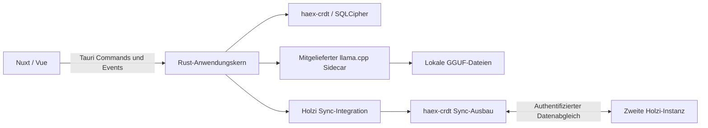

# Holzi: erster Desktop-MVP mit lokalem Chat und CRDT-Sync

Stand: 2026-09-07. Geplant gegen Holzi-Commit `73788177109ccd7dd1cd367997ee1caec05189d5`.
Status: **Entwurf zur Produkt- und Architekturabstimmung**, keine freigegebene Implementierungsspezifikation.
Betreiber-Klarstellung vom 2026-09-07: Secrets gehören in die verschlüsselte Instanzdatenbank und niemals in Git; `haex-crdt` wird vom Betreiber für den Sync zwischen zwei SQLite-Instanzen ausgebaut.
Priorität P1 · Aufwand L · Integrationsrisiko hoch · Kategorie direction.

## Ziel und Abnahme

Der Betreiber installiert Holzi, legt eine passwortgeschützte Instanz an und führt einen Chat mit einem lokal laufenden Modell. Nach einem Neustart sind die Gespräche vorhanden. Eine zweite, eigenständige Instanz auf einem eigenen Gerät lässt sich koppeln. Beide Geräte können offline weiterchatten und gleichen ihre Verläufe nach Wiederverbindung ab.

**Erste nutzbare Zwischenversion:** Instanz anlegen, entsperren, lokal chatten, schließen und wieder öffnen. **Der angefragte MVP ist erst mit funktionierendem Zwei-Geräte-Sync fertig.** Ein Scanner-Test allein erfüllt das nicht.

Planungsannahme: zuerst ein Desktop-Zielsystem; vorläufig Linux, Hardware noch offen. Weitere Desktop-Plattformen folgen nach dem ersten paketierten Durchlauf. Kein bestimmtes Modell und keine GPU-Leistung werden vorausgesetzt.

## Einschätzung des bestehenden Repos

Die Produktidee ist nachvollziehbar: eigene Instanzen, lokale Datenhaltung, explizite Modellwahl und eine kleine Vertrauensgruppe eigener Geräte. Die Auslagerung von SQLCipher/CRDT in `haex-crdt` ist eine sinnvolle Grenze. Der vorhandene v1-Entwurf bündelt allerdings bereits Mobile, Server, Nostr, MCP, Fernsteuerung und mehrere Modellanbieter. Das ist deutlich mehr als der hier gewünschte erste Nutzwert.

Es existiert noch kein Anwendungscode, kein `package.json` und kein `Cargo.toml`. Damit sind Build-, Laufzeit-, Sicherheits- und Leistungseigenschaften von Holzi noch nicht überprüfbar. Geprüft wurden Architekturunterlagen, Onboarding-Spezifikation, Dokumentations-CI und gezielt die öffentliche API des vorhandenen `haex-crdt`-Checkouts; kein vollständiges Audit dieses externen Crates.

| Befund | Bedeutung | Aufwand der Klärung | Änderungsrisiko | Beleg |
| --- | --- | --- | --- | --- |
| v1 umfasst wesentlich mehr als den ersten lokalen Chat mit Sync | MVP-Schnitt explizit festhalten, bevor die bestehende Taskliste abgearbeitet wird | S | mittel | `docs/plans/2026-09-04-v1-scope-design.md`, §§2, 11 |
| Bestehende Dokumente beschreiben den damaligen Crate-Umfang ohne Sync-Transport | Den angekündigten Sync-Ausbau von `haex-crdt` integrieren; API und Transportzuständigkeit vor Integration abstimmen | S | mittel | Extraktionsplan, Einleitung; Betreiber-Klarstellung vom 2026-09-07 |
| Kanonische Keychain-Pflicht geht über die erklärte Absicht „keine Secrets in Git“ hinaus | Produktziel SQLite festhalten und Konstitution separat korrigieren | S | gering | Betreiber-Klarstellung; Abschnitt Schlüsselhaltung unten |
| Restore als neue parallele Identität und Handover mit stillgelegter Quelle werden vermischt | Import nicht beiläufig in den MVP aufnehmen | M | hoch | v1-Scope §4 gegenüber §5; `haex-crdt/src/database/config.rs` am unten genannten Commit |
| Laufzeit- und Testbasis fehlen | Ein kleiner realer Integrationsdurchlauf muss vor UI-Ausbau stehen | M | gering | `README.md:23`, `.github/workflows/ci.yml` |

Die Befunde sind durch die gelesenen Dokumente/API belegt; Aufwand ist eine Planungsschätzung. Es werden keine Implementierungsfehler in noch nicht existierendem Code behauptet.

## Bestehende Entscheidungen und vorgeschlagene Abweichungen

Beibehalten: Tauri 2, Rust, Nuxt 4 als SPA (`ssr: false`), Vue, Pinia, Tailwind und shadcn-vue; SQLCipher über `haex-crdt`; genau eine aktive Instanz pro App-Prozess; deutsch/englische UI; vollständig lokal gebündelte Icons. Kein zusätzlicher Node-Server im installierten Produkt.

Der bestehende erste Slice ist ein Nostr-Ping zwischen zwei Geräten und schließt den Modellrunner ausdrücklich aus. **Dieser Vorschlag zieht lokalen Chat vor und verschiebt die vollständige Nostr-Steuerungsebene.** Das ist eine bewusste neue Reihenfolge, keine Behauptung, die vorhandene Spec sei damit umgesetzt.

Der Betreiber baut `haex-crdt` für den Datenabgleich zwischen zwei SQLite-Instanzen aus. Holzi konsumiert diese Fähigkeit über eine schmale Integrationsschicht. Der frühere Vorschlag eines eigenen iroh-Sync-Protokolls in Holzi entfällt. Welche Transport-, Pairing- und Wiederanlauffunktionen das Crate konkret liefert und welche Adapter es vom Consumer erwartet, wird am Integrationsvertrag geklärt. Die bestehende Nostr-Pairing-Entscheidung wird durch diese Klarstellung weder aufgehoben noch durch ein zweites Pairing-System ersetzt.

Noch nicht im MVP: Mobile, Headless-Server, externe MCP-Schnittstelle, Agenten-Tools/Shell-Ausführung, geräteübergreifende LLM-Aufträge, Cloudanbieter, NIP-17, Cross-User-Sharing, RAG, Skills/Memory, Modellübertragung, Sprache/Video. Ebenfalls zurückstellen: Import/Restore beliebiger `.db`-Dateien und komplexe Instanzwechsel-UI. Reguläres Wiederöffnen einer selbst angelegten Instanz gehört dagegen zum MVP.

## Schlüsselhaltung: Produktziel und Korrektur der Konstitution

Der Betreiber hat klargestellt: Holzi hält Secrets wie ein Passwortmanager in seiner verschlüsselten SQLite-Datenbank. Die Regel soll verhindern, dass Secrets in Git gelangen; sie soll keine OS-Keychain als einzig zulässigen Speicher vorschreiben. Das Produktziel ist damit entschieden. Die Datenbank liegt im privaten App-Datenverzeichnis außerhalb des Repos. Private Instanzschlüssel bleiben lokale Daten und werden nicht mit anderen Instanzen synchronisiert. Die Entsperr-Passphrase wird zur Laufzeit eingegeben; sie wird nicht neben der Datenbank als Klartext gespeichert.

Die bisher angeheftete kanonische Konstitution aus Repository `https://github.com/haexmas/haex-hive`, Revision `336eaf1e5b1a86f76031b60b7f692da98682b9ac`, Pfad `.specify/memory/constitution.md`, Prinzip I, enthält noch:

> Secrets live in the OS keychain of each device

Der Holzi-Entwurf §4 beschreibt bereits das gewünschte Produktmodell:

> Keys never leave the encrypted database.

**Vorgeschlagene Korrektur zur separaten Prüfung:** „Secrets und Schlüsselmaterial dürfen weder im Klartext noch verschlüsselt in Git eingecheckt werden. Diese Regel schreibt keinen bestimmten Laufzeitspeicher vor; anwendungseigene verschlüsselte Datenbanken außerhalb von Git sind zulässig.“

Dieser Plan hält die Betreiberabsicht und den Änderungsvorschlag fest; er ändert weder die kanonische Konstitution noch deren Pin. Der widersprechende Wortlaut muss vor der entsprechenden Schlüsselimplementierung über das vorgesehene Amendment korrigiert werden. Eine alternative Keychain-Produktarchitektur ist nicht mehr zur Auswahl gestellt.

Verschlüsselte Speicherung ist eine passende Architektur für dieses Produktziel; ihre konkrete Sicherheit muss die Implementierung zeigen: SQLCipher-Schlüsselverarbeitung, Entsperr-/Sperr-Lebenszyklus und Schutz vor Klartextkopien in Logs oder temporären Dateien gehören zur Abnahme. Es wird nicht allein aus dem Vorhandensein von Verschlüsselung eine geprüfte Sicherheit behauptet.

## Architektur und Verantwortlichkeiten

Die folgenden Modulnamen sind Zielvorschläge, keine vorhandenen APIs:

| Bereich | Verantwortung / Zielort |
| --- | --- |
| Instanzlebenszyklus | `src-tauri/src/instances/`: Erstellen, Entsperren, Sperren, Crash-Aufräumen; vorhandene Command-Verträge dort wiederverwenden |
| Storage | `src-tauri/src/storage/`: Migrationen, Abfragen, CRDT-Write-Pfad und Tabellenfreigaben |
| Lokaler Runner | `src-tauri/src/llm/`: Start/Stop, Modellprüfung, Streaming, Abbruch, Fehlerzustände |
| Chat | `src-tauri/src/chat/`: Prompt-Zusammenstellung, Persistenz und lokale Generierungsaufträge |
| Pairing | `src-tauri/src/pairing/`: Holzi-Vertrauen und Pairing-UI; technische Anbindung gemäß gemeinsamem Sync-Vertrag |
| Sync | `src-tauri/src/sync/`: schmaler Adapter zum ausgebauten `haex-crdt`, Start/Stop, Peer-/Tabellenfreigaben, Status/Fehler für die UI |
| UI | `src/pages/`, `src/components/onboarding/`, ergänzend Chat/Modell/Peer-Komponenten und Pinia-Stores |

Rust besitzt Dateien, Datenbank, Schlüsselzugriffe, Prozesshandles und Netzwerk. Die WebView bekommt typisierte Commands und Events, keine beliebige SQL- oder Shell-Schnittstelle. Blockierende Datenbank- und Modelloperationen laufen außerhalb des UI-Threads. Ein Instanzwechsel oder Sperren beendet Generierung und Sync; verspätete Events tragen Instanz- und Request-ID und dürfen keinen anderen Chat verändern.

## Datenmodell

Zunächst nur stabile IDs und kurze, atomare Schreibvorgänge. `haex-crdt` bietet spaltenweises Last-Writer-Wins mit Hybrid Logical Clocks; das ist kein kollaborativer Texteditor.

| Daten | Persistenz | Sync |
| --- | --- | --- |
| Gespräche | `conversations`: ID, Titel, Ersteller, logische Erstellzeit | ja |
| Fertige oder explizit abgebrochene Nachrichten | `messages`: ID, Gespräch, Elternnachricht, Rolle, Inhalt, Ersteller, Modell-Fingerprint, Abschlussstatus | ja |
| Peer-Grants und Revocations | Signierte, einzeln identifizierte Fakten; effektives Vertrauen daraus ableiten | ja, mit gesonderter Autorisierungsprüfung |
| Lokale Modellzuordnung | Modell-Fingerprint → lokaler Dateiverweis, Kontext-/Runtime-Einstellungen | nein |
| Generierungsauftrag und Zwischenstand | lokale Tabelle mit Request-ID; nach Crash als unterbrochen behandeln | nein |
| Sync-Fortschritt und Installations-/Datenbank-Zuordnung | lokale Metadaten, getrennt pro Peer | nein |
| Private Identitätsschlüssel | Produktziel: lokale `instance_identity`-Tabelle innerhalb der SQLCipher-Datenbank; erforderliche Wortlautkorrektur siehe Schlüsselhaltung | niemals |
| GGUF-Gewichte | App-eigener Modellordner oder ausdrücklich gewählte lokale Datei, außerhalb der SQLite | nein |

Nachrichten nach Veröffentlichung nicht im selben Datensatz parallel bearbeiten. Zwei Geräte dürfen neue Nachrichten mit verschiedenen IDs erzeugen. Elternbezüge erhalten Verzweigungen; eine deterministische Geschwistersortierung mit logischer Zeit plus ID verhindert wechselnde Reihenfolgen. Für eine neue Generierung explizit den verwendeten Elternpfad bestimmen. Ein monolithisches JSON-Array pro Gespräch würde durch LWW ganze Verläufe verdrängen.

Streaming läuft über Tauri-Events. Ein lokaler Zwischenstand darf gedrosselt gespeichert werden; synchronisiert wird erst der finale bzw. explizit abgebrochene Datensatz. Ein empfangener Chatdatensatz startet niemals automatisch einen LLM-Aufruf. Pro aktivem Gerät zunächst höchstens eine Generierung gleichzeitig.

Nur explizit freigegebene Tabellen und Spalten gehen in Scan **und** Apply. `_no_sync`-Tabellen nicht automatisch registrieren; der Suffix ersetzt keine Eingangsprüfung. Absolute Modellpfade, Passphrasen, Tokens, private Schlüssel und Prozesszustände sind kein Sync-Payload.

## LLM-Auswahl und Auslieferung

Empfehlung zum Erproben: `llama.cpp` mit `llama-server` als von Rust kontrolliertem Tauri-Sidecar. Tauri unterstützt gebündelte externe Programme pro Zielarchitektur; der Server bietet Streaming, Gesundheitsprüfung und API-Authentifizierung. Quellen: [Tauri Sidecars](https://v2.tauri.app/develop/sidecar/), [llama.cpp Server](https://github.com/ggml-org/llama.cpp/blob/master/tools/server/README.md).

Holzi startet den Runner bedarfsgesteuert mit expliziter Loopback-Bindung und kurzlebiger Authentifizierung; Kommunikation nur aus Rust. Keine Tokens in Logs oder Prozessargumenten, wenn sie sich über einen geschützten Mechanismus übergeben lassen. Fremde lokale Requests werden abgewiesen. Startfehler, belegter Port, Prozessabsturz und Shutdown dürfen keinen verwaisten Runner zurücklassen. Keine aktivierten Server-Tools, keine persistierten Klartext-Prompt-Caches.

Erster Durchlauf: ein lokal importiertes, unterstütztes GGUF-Instruct-Modell. Als Größenklasse zunächst ein kleines quantisiertes Modell prüfen; konkrete Familie, Quantisierung, Kontextfenster und Beschleuniger anhand der Zielhardware wählen. Modellgröße auf Disk ist nicht gleich RAM-Bedarf: KV-Cache und Runtime mitmessen. Kein automatischer Modellwechsel und kein Cloud-Fallback.

Für ein auslieferbares Paket: Runner-Revision, Zielarchitektur und Prüfsumme festhalten. Ein freigegebenes kleines Modell samt Modellkarte, Herkunft, Revision, Dateihash und erforderlichen Hinweisen als Offline-Modellpaket bereitstellen; Modellgewichte nicht in Git. Alternativ kann der Betreiber ein GGUF importieren. Klar unterscheiden: „nach Modellimport offline“ und „offline ab Erstinstallation mit Modellpaket“. Die Desktop-Sidecar-Entscheidung beantwortet Mobile-Inferenz noch nicht.

## Sync-Vertrag mit dem Ausbau von haex-crdt

`haex-crdt` wird vom Betreiber für den Datenabgleich zwischen zwei SQLite-Instanzen erweitert. Das ist eine externe Entwicklungsabhängigkeit, keine Aufforderung, diesen Ausbau im Holzi-Repo nachzubauen. Der zuvor gelesene Commit beschreibt nur den damaligen Stand; neue Sync-APIs und deren Lieferumfang sind noch nicht überprüft.

Holzi besitzt seine Instanzen, sein Anwendungsschema, Modell-/Chatlogik und die Entscheidung, welche Peers welche Daten erhalten. `haex-crdt` soll die wiederverwendbare Synchronisierung liefern. Ob es den Transport selbst betreibt oder einen Transportadapter erwartet, bleibt bis zum abgestimmten Vertrag offen. Es gibt noch keine Entscheidung für einen zusätzlichen Holzi-eigenen iroh-Kanal, einen Vollabgleich oder eine bestimmte Cursorstrategie.

Vor Integration gemeinsam festlegen:

| Vertragspunkt | Benötigtes Ergebnis |
| --- | --- |
| Initialisierung und Lebenszyklus | Sync an eine geöffnete Datenbank binden, starten, pausieren und sauber stoppen können |
| Peer-Anbindung | Zuständigkeit für Verbindungsaufbau, Pairing und authentifizierten/verschlüsselten Transport benennen |
| Datenfreigabe | Holzi kann lokale Tabellen und Spalten sowohl beim Senden als auch beim Empfangen ausschließen |
| Vertrauen | Peerfreigaben prüfen und widerrufen können; eine erkannte Peer-ID allein gewährt keinen Zugriff |
| Wiederverbindung | Offline-Änderungen und unterbrochene Übertragungen zuverlässig nachholen |
| Merge | Gleichzeitige Änderungen konvergieren; doppelte/umgeordnete Zustellung verursacht keinen Datenverlust |
| Beobachtbarkeit | Status, Fehler und empfangene Änderungen an die Holzi-UI melden können |
| Kompatibilität | Unterstützte Schema-/Protokollversionen und Verhalten bei inkompatiblen Daten dokumentieren |

Die genaue API wird aus dem Crate übernommen und am gewählten Commit dokumentiert, nicht in diesem Plan erfunden. Fortschrittsmarken, Wiederholungen, Pagination und eventuelle Compaction sollen einmal im dafür zuständigen Sync-Baustein gelöst werden. Falls das Crate dafür Consumer-Aufgaben vorsieht, müssen diese vor der Aufwandsschätzung explizit benannt werden.

Zwei frisch angelegte Datenbanken besitzen unterschiedliche Instanzidentitäten und HLC-Device-IDs; eine Dateikopie ersetzt Pairing nicht. Jede Datenbank kann ein eigenes Passwort verwenden. SQLCipher-Dateiverschlüsselung und verschlüsselter Transport sind getrennte Anforderungen. Die bestehende Non-Escalation- und Revocation-Semantik für Holzi-Peers bleibt Grundlage; CRDT-Konvergenz ersetzt keine Berechtigungsprüfung.

Gemeinsame Abnahme: zwei getrennte verschlüsselte SQLite-Dateien synchronisieren, Verbindung trennen, auf beiden Änderungen schreiben, wieder verbinden und Konvergenz nachweisen. Zusätzlich Duplikate, umgeordnete Zustellung, Neustart nach unterbrochenem Transfer, widerrufene Peers und den Ausschluss privater Schlüssel testen. Empfangen synchronisierter Chatdaten darf keine lokale LLM-Generierung starten.

Primäre Netzwerkabnahme: zwei Geräte im selben LAN. Lokaler Chat funktioniert während des Sync-Ausbaus und bei Netz-/Relay-Ausfall. Internet-Erreichbarkeit wird erst zugesagt, wenn der gelieferte Transport sie unterstützt und die Integration getestet ist. Chat-Löschen und Restore bleiben im ersten Slice zurückgestellt; spätere Löschsemantik und Retention mit dem Crate-Vertrag abstimmen.

## Umsetzung in prüfbaren Etappen

Vor Implementierung werden diese Etappen im vorhandenen Speckit-Ablauf spezifiziert und geprüft (`.specify/workflows/speckit/workflow.yml`). Dieser Beratungsentwurf ersetzt weder Spec-Review noch Plan-Review. Bestehende Spec 001 gezielt eingrenzen und korrigieren; keine parallele widersprüchliche Onboarding-Spec schreiben.

### 0. Entscheidungen und Integrationsbasis klären — etwa 1–3 Arbeitstage

Zielsystem/HW aufnehmen; den Sync-Integrationsvertrag mit dem Ausbau von `haex-crdt` abstimmen. Das Produktziel der Schlüsselhaltung ist geklärt: verschlüsselte SQLite; die kanonische Formulierung separat nachziehen. Für lokale Instanz und Chat die vorhandene Storage-API verwenden; fehlende Sync-Funktionen dürfen diese Arbeit nicht blockieren. Für die spätere Sync-Integration eine erreichbare unveränderliche Revision mit den erforderlichen Fähigkeiten festlegen. Nicht anhand der Versionsnummer allein integrieren: der gelesene Checkout trägt `0.1.0` im Manifest, enthält aber bereits weitere API-Änderungen.

Gelesene Referenz: Repository `https://github.com/haexmas/haex-crdt`, Commit `775d62d5375171c5947b2b1e93648d5ff4f2c245`, Dateien `Cargo.toml`, `README.md`, `src/database/config.rs`, `src/database/mod.rs`, `src/crdt/scanner/mod.rs`, `tests/end_to_end.rs`. Vor Verwendung prüfen, dass der Commit remote erreichbar ist; keine absolute Pfadabhängigkeit committen. Kein Crate-Release ist durch diese Lektüre als bereits veröffentlicht bestätigt.

Zum Zeitpunkt der Bestandsaufnahme vorhandene API, noch kein Vertrag für den angekündigten Sync-Ausbau: `Database::open(DatabaseConfig)`, `SqlCipherKey`, `DeviceIdProvider`, `MigrationSource`, `SignatureProvider`, `install_crdt`, `scan_table_for_local_changes`, `apply_remote_changes`. Genesis/Join sind Holzi-Aufgaben. Den Produktions-Schreibpfad mit HLC-Injektion/Triggern prüfen; ein gewöhnliches SQL-Update darf keine fehlenden CRDT-Metadaten erzeugen. Bei `raw-connection` die reexportierten rusqlite-Typen bzw. identische Auflösung verwenden.

Nachweis: Test mit zwei temporären SQLCipher-Dateien, verschiedenen Passwörtern und Device-IDs, realem Write → Scan → Apply → Reopen. Ein lokaler Modellprompt mit dem geplanten Runner auf der Zielhardware. Festhalten: Runnerstart, Zeit bis erstes Token, Tokens/s, Spitzen-RAM und verwendeter Kontext. Erst danach konkrete Leistungsziele festlegen.

### 1. App und Instanzlebenszyklus — etwa 2–4 Arbeitstage

Scaffold nach `specs/001-frontend-onboarding/plan.md`: `src/` und `src-tauri/`, dazu Toolchain und Lockfiles. Landing, Anlegen, Liste selbst angelegter Instanzen, Unlock und Sperren. DB-Namen validiert der Backendpfad; keinerlei managed paths vom Frontend. Atomare Erstellung samt Pending-Marker und Crash-Cleanup. Schlüsselhaltung ausschließlich nach aufgelöstem Gate aus Etappe 0.

Abnahme: Erstellen → schließen → entsperren erhält Daten/Identität. Falsches Passwort, Namenskollision, fehlende Rechte und Prozessabbruch führen nicht zu Datenverlust oder halbfertiger aktiver Instanz. Kein Netzwerk muss für diesen Ablauf verfügbar sein.

### 2. Nutzbarer lokaler Chat — etwa 3–5 Arbeitstage

Runner-Lebenszyklus, Modellimport/-auswahl, Conversation-Liste, Chat, Streaming und Stop implementieren. Nachrichten über denselben CRDT-fähigen Write-Pfad persistieren. Kontextbudget und explizite Fehlermeldung bei zu langem Gespräch vorsehen; keine stillschweigende unbegrenzte Historie an den Runner senden.

Abnahme: ohne laufendes Ollama, ohne API-Key eines Anbieters und ohne Internet antwortet das importierte Modell. Antwort bleibt nach Neustart erhalten. Stop, ungültiges Modell, Speichermangel, Runner-Crash und Sperren während Streaming enden in nachvollziehbarem Zustand. Das ist die erste tägliche Nutzversion.

### 3. Ausbau von haex-crdt integrieren — etwa 1–3 Arbeitstage bei fertigem Sync-Vertrag

Voraussetzung: der Betreiber liefert eine gepinnte `haex-crdt`-Revision mit abgenommenem Zwei-Instanzen-Sync und dokumentierten Consumer-Aufgaben. Holzi bindet diese API an Instanzlebenszyklus, Peerfreigaben und Sync-Status an. Pairing gemäß abgestimmtem Vertrag integrieren, ohne ein eigenes konkurrierendes Protokoll zu bauen. Autorisierung vor Datenfreigabe und Apply sicherstellen; lokale Tabellen konsequent ausschließen. Vertrauen widerrufen und laufenden Zugriff beenden können. Trust-Grants/-Revocations nicht durch beliebige LWW-Feldüberschreibungen entscheiden, sondern signierte Fakten erhalten und effektiv auswerten.

Abnahme: A und B zunächst synchron; Netz trennen; auf beiden neue Gespräche/Nachrichten erstellen und den Titel desselben Gesprächs ändern; wieder verbinden. Beide behalten alle neuen Nachrichten und zeigen denselben Konfliktgewinner für den Titel. Beide Richtungen, Duplikate, umgeordnete Batches, verlorene Quittierung, Prozessneustart sowie unautorisierter/widerrufener Peer sind getestet. Kein empfangener Datensatz löst eine Generierung aus.

### 4. Paket und Endabnahme — etwa 2–4 Arbeitstage

Ein installierbares Paket für das Zielsystem mit Runner und nachvollziehbarem Modellimport bzw. Offline-Modellpaket liefern. Auf sauberem Zielsystem prüfen, nicht nur in `tauri dev`. Lizenz-/Herkunftshinweise der gewählten Artefakte übernehmen; keine Modellgewichte oder realen DB-Dateien in Git. Kurze Anleitung für Installation, Unlock, Modell und Pairing.

Abnahme: kompletter Ablauf vom Installieren bis Offline-Chat und Wiederverbindungs-Sync auf zwei Geräten. Ein Mock-Webtest zählt nicht als Nachweis für SQLCipher, natives IPC oder den gebündelten Runner.

Holzi-Aufwand vorläufig **9–19 fokussierte Arbeitstage**, sofern `haex-crdt` den vereinbarten Sync gebrauchsfertig liefert. Der separate Crate-Ausbau und die Wartezeit darauf sind darin nicht enthalten. Ungeklärte Integrationsaufgaben, Packaging und GPU-Treiber können das erweitern; Mobile und vollständiges Nostr-v1 sind ebenfalls nicht enthalten. Nach Festlegung der Sync-API neu schätzen; lokale App und Chat können während des Crate-Ausbaus entstehen.

## Verifikation: vorhanden und erst einzurichten

Heute ausgeführt und erfolgreich:

- `python3 scripts/ci/check-docs.py` → `Documentation checks passed.`
- `git diff --check` → keine Whitespace-Fehler.

Heute existieren keine ausführbaren App-Tests. Folgende Befehle sind **Zielverträge, die im Scaffold erst eingerichtet werden müssen**, keine bereits erfolgreich ausgeführten Repository-Kommandos:

| Gate | Geplanter Befehl | Erwartung |
| --- | --- | --- |
| Rust Storage/Instanz | `cargo test --manifest-path src-tauri/Cargo.toml --test instance_lifecycle` | obige Fehler- und Reopen-Fälle bestanden |
| Rust CRDT-Integration | `cargo test --manifest-path src-tauri/Cargo.toml --test storage_sync` | zwei echte verschlüsselte Dateien konvergieren |
| Runner-Lebenszyklus | `cargo test --manifest-path src-tauri/Cargo.toml --test local_runner` | Start/Stop/Fehlerisolation bestanden; deterministischer Testprozess |
| Reales Modell | `pnpm test:llm-smoke` | echtes paketiertes Binary und explizit angegebenes lokales Modell antworten; fehlendes Modell ist Fehler, kein Skip-Erfolg |
| Pairing/Netzwerk | `cargo test --manifest-path src-tauri/Cargo.toml --test peer_sync` | reale Loopback-Endpunkte, Fehlerfälle und Konvergenz bestanden |
| Frontend | `pnpm typecheck` und `pnpm test:unit` | Typprüfung und relevante UI-Zustände bestanden |
| Web-UI | `pnpm test:e2e` | Playwright: Onboarding/Chat/Status, Offline-Assets; IPC-Mocks ausdrücklich als solche kennzeichnen |
| Paket | `pnpm tauri build` | startbares Artefakt enthält passende Runner-Architektur |
| Native Abnahme | `pnpm test:native-smoke` | im Scaffold einzurichtender Plattformtest gegen echte App; ergänzt durch Zwei-Geräte-Abnahme |

Für jedes Gate vor Implementierung konkrete Testdateien gemäß der Tabelle anlegen und dessen Existenz/Ergebnis im jeweiligen Slice nachweisen. Es gibt in Holzi noch kein Testmuster; für Storage am gepinnten externen `tests/end_to_end.rs` orientieren. Für den nativen Test geeigneten Treiber anhand des Zielsystems wählen: [Tauri Tests](https://v2.tauri.app/develop/tests/). Browserautomation mit gemocktem Tauri-IPC ersetzt diesen Test nicht.

## Scope und Änderungsdisziplin

Dieser Entwurf verändert ausschließlich `plans/001-desktop-mvp.md` und `plans/README.md`. Bestehende Spezifikationen und Harness-Instruktionen bleiben als Referenzen erhalten.

Spätere Umsetzung betrifft nach Spec-Review: `src/`, `src-tauri/`, `tests/`, `e2e/`, Build-/Paketkonfiguration, Toolchain/Lockfiles, passende CI und abgestimmte Änderungen unter `specs/001-frontend-onboarding/` bzw. weitere nummerierte Specs für Chat/Sync. Themenbranches und Conventional Commits wie im Repo; Integration über PR mit Rebase- oder Merge-Commit, kein Squash. Keine externe Crate-Änderung stillschweigend als Holzi-Aufgabe erledigen.

Vor Start Drift prüfen: `git diff --stat 73788177109ccd7dd1cd367997ee1caec05189d5..HEAD -- README.md docs specs .specify .haex-hive.json`. Neue Implementierung oder geänderte Schnittstellen erfordern Planabgleich. Vor neuen Codeartefakten gilt der bereits deklarierte graphify-Authoring-Check; dieser Dokumententwurf führt noch keine Codeartefakte ein.

## Gates und Wartung

- Schlüsselhaltung ist als Produktziel entschieden: verschlüsselte SQLite. Vor entsprechender Implementierung die noch abweichende kanonische Keychain-Formulierung in einem separaten geprüften Amendment korrigieren; keine erneute Produktentscheidung über Keychain versus SQLite nötig.
- Die bestehende Onboarding-Spec gilt erst als erfüllt, wenn ihre Anforderungen implementiert oder ausdrücklich per Review neu zugeschnitten wurden.
- Wenn der Sync-Ausbau noch nicht verfügbar ist oder den Zwei-DB-Test nicht besteht, die Integration dieser Etappe zurückstellen und am lokalen Chat weiterarbeiten; weder einen zweiten CRDT-Kern noch einen eigenen Ersatztransport bauen.
- Restore bleibt zurückgestellt, bis der Unterschied zwischen Handover und gleichzeitig lebender Kopie einschließlich neuer Schlüssel/Device-ID spezifiziert und getestet ist.
- Falls das gewählte Modell die Zielhardware überfordert, Paket/Modellwahl sichtbar anpassen; kein automatisches Ausweichen auf einen Dienst.
- Bei späterem Multi-Hop-Sync Ursprungsidentität und Cursorlogik neu prüfen. Bei Löschen braucht es Tombstones, Retention und Resync nach zu langer Offlinezeit. Bei Mobile muss der Runner und dessen Lebenszyklus neu bewertet werden.

Die erste Entwicklungsaufgabe nach der Spezifikationsabstimmung ist der reale SQLCipher/CRDT- und Runner-Durchlauf aus Etappe 0. Er reduziert die beiden größten technischen Unbekannten, bevor eine größere Oberfläche entsteht.
